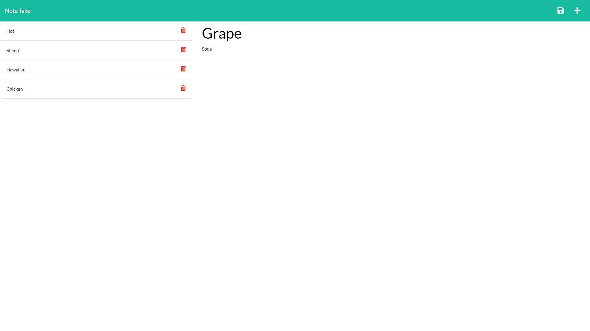
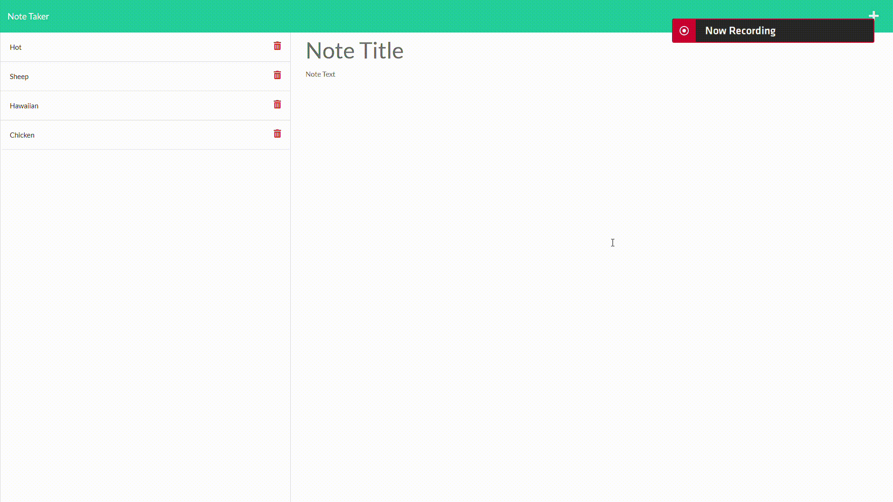

# Simple Note Taker

## Overview
In the following exercise, the user is given HTML documents that take text inputs and saves them as JSON data and is tasked with creating a server script that links the Front-end and Back-end functionalities. 

## Table of Contents

  - [Pseudocode](#pseudocode)
  - [Installation](#installation)
  - [Usage](#usage)
  - [Resources](#resources)
  - [Links](#links)
  - [Screenshots](#screenshots)
    - [Desktop](#desktop)
  - [Demo](#demo)

## Pseudocode
1. Create a server script.
2. Setup a listening PORT.
3. Setup routing for the HTML documents.
4. Setup routing for API methods.
5. Give 'GET', 'POST', and 'DELETE' methods functionality.
6. Assign item id's in 'POST' method and remove items by id in 'DELETE'.
7. Deploy app on Heroku.

## Installation
1. ```npm init```
2. ```npm i express```
3. ```npm i -D nodemon```

## Usage
1. ```node server.js``` to run the app, if not using Heroku.
2. Enter a title in the input for title.
3. Enter text in the text area.
4. Click on the "plus" icon to create a new item.
5. Click on the "save" icon to save an item.
6. Click on the saved item to view it again.
7. To delete a saved item, click on the corresponding "trash can" icon.

## Technologies Used
- HTML
- CSS
- JavaScript
- JSON
- Express

## Resources
- [nodemon](https://www.npmjs.com/package/nodemon)
- [Express](https://www.tutorialspoint.com/expressjs/index.htm)
- [Heroku](https://www.heroku.com/home)

## Links
- [Heroku Deployed App](https://note-taker-huirayj.herokuapp.com/)
- [Repository](https://github.com/huirayj/note-taker)

## Screenshots
### Desktop


## Demo


